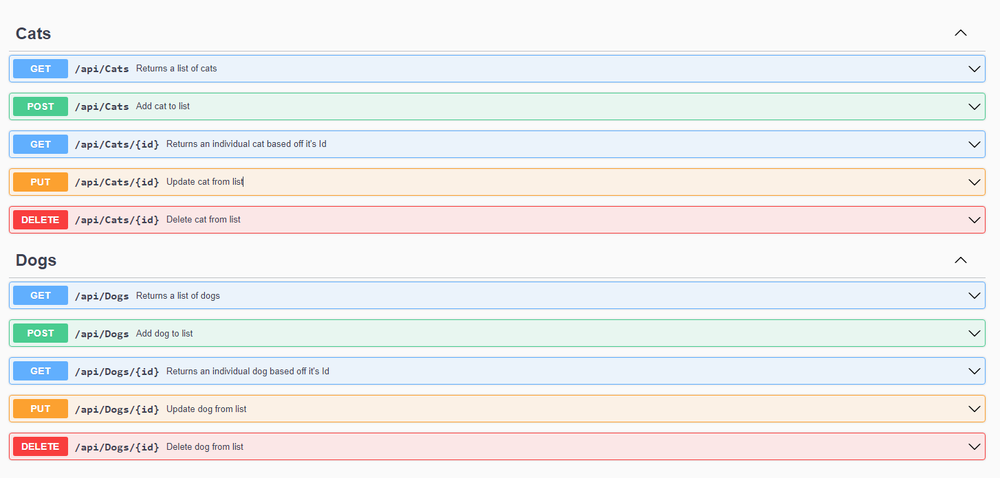

# Animal Shelter API

#### By Caleb Coughenour

#### This is an API built for adding cats and dogs to an animal shelter API, built using C#/ASP.NET

## Technologies Used

* C#
* API
* SQL
* ASP.NET
* Entity Framework
* REPL
* Swagger

## Description

 This webpage was programmed using C#, ASP.NET & Entity. It is an API that allows users to add cats and dogs to an API database. The properties for each are name, species, age, gender and the date/time will be included as well. When the page is ran it will open the localhost:5000/index.html page showing the swagger UI. From the swagger UI the user can interact directly with the API database. Full CRUD functionality is available.

 ## Required

* [REPL](https://dotnet.microsoft.com/en-us/download/dotnet/thank-you/sdk-5.0.401-windows-x64-installer) - restart terminal after install
* .NET (install using "dotnet tool install -g dotnet-script" in console)
    - Configure Bash environment variables by running "echo 'export PATH=$PATH:~/.dotnet/tools' >> ~/.bash_profile" in your gitbash terminal
* [SQL Workbench](https://downloads.mysql.com/archives/get/p/25/file/mysql-installer-web-community-8.0.19.0.msi)
    - You will need to include your password in the appsettings.json file

## Setup/Installation

* Copy the git repository url from the "code" drop down on this github page
* Open a shell program & navigate to your desktop
* Clone the repository using the copied URL and the "git clone" command
* In the shell program, navigate to the root directory of the newly created file called "AnimalShelterApi.Solution"
* From the root directory, navigate to the directory named "AnimalShelterApi"
* In this directory create a file named "appsettings.json"
* Add the following code to the newly created .json file
```
{
  "ConnectionStrings": {
      "DefaultConnection": "Server=localhost;Port=3306;database=caleb_coughenour;uid=root;pwd=[YOUR-PASSWORD];"
  }
}
```
* Replace "[YOUR-PASSWORD]" with your SQL password
* 
* Next, in the AnimalShelterApi directory type "dotnet run" to start the program
* When the app runs it will automatically open a webpage and display the Swagger UI for the API

 ## API Calls (all calls can be done on both cats & dogs)

  1. GET - http://localhost:5000/api/Cats?name=Artemis&species=Mainecoon&age=5&gender=Female
 ```
 ($"cats", Method.GET)
 ```
  * The keys in this url are not required, but these are all the queries available

 2. GET{id} - http://localhost:5000/api/Cats/2
 ```
 ($"cats/{id}", Method.GET)
 ```
  * The Id at the end can be replaced with any existing Id

 3. POST - Name & Species are required - http:localhost:5001/api/Cats
```
 ($"cats", Method.POST)
```
```json
  {
    "catId": 2,
    "name": "Artemis",
    "species": "Mainecoon",
    "age": 5,
    "gender": "Female",
    "dateCreated": "2022-06-10T20:45:58.221"
  }
```
  * The date/time will be added automatically and is in UTC

  4. PUT{id} - This will update an exisisting entry - http:localhost:5000/api/Cats/2
  ```
  ($"cats/{id}", Method.PUT)
  ```
  * Name & species will be required for updating 

  5. DELETE{id} - http://localhost:5000/api/Cats/2
  ```
  ($"cats/{id}", Method.DELETE)
  ```

  

## Known Bugs

* There is no authentication currently, I am working on adding JWT authentication but it is not implemented yet

## License

[MIT](LICENSE)

Copyright (c) 6/10/22 Caleb Coughenour